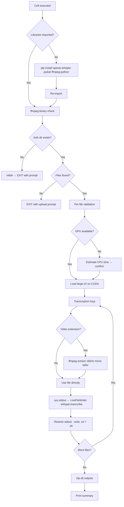

<div align="center">

# 🎙️ Whisper Notebooks

### Free AI tools for audio transcription and subtitle video creation — running on Google Colab

[](https://python.org)
[](https://github.com/openai/whisper)
[](https://colab.research.google.com)

</div>

---

A collection of Google Colab notebooks for AI-powered audio transcription and subtitle video production. No coding required — open a notebook, upload your files, and run the cell.

---

## 📓 Notebooks

### 1. Whisper Bulk Transcriber

[](https://colab.research.google.com/github/lilhawkeye2002-ux/Whisper_Notebooks/blob/main/Whisper_Bulk_Transcriber.ipynb)

Transcribe any number of audio or video files into `.txt`, `.srt`, and `.vtt` using OpenAI Whisper `large-v2`. Drop your files in a folder and run one cell.

| Feature | Detail |
|---|---|
| 🎧 Audio formats | `.mp3` `.wav` `.m4a` `.flac` `.aac` `.ogg` `.wma` `.opus` `.aiff` `.amr` `.au` |
| 🎬 Video formats | `.mp4` `.mov` `.avi` `.mkv` `.webm` — audio extracted automatically |
| 📝 Output formats | `.txt` plain text · `.srt` subtitles · `.vtt` web captions |
| 📦 Bulk processing | Entire folder in one run |
| 🌏 Language | Auto-detects language — tested with English, Japanese, and more |
| 🆓 Cost | Free — runs on Colab's T4 GPU |

---

### 2. Whisper Bulk Transcriber — Alt Timestamp Method

[](https://colab.research.google.com/github/lilhawkeye2002-ux/Whisper_Notebooks/blob/main/Whisper_Bulk_Transcriber_AltTimestampMethod.ipynb)

Same bulk transcription as above, but uses **DTW-forced alignment** to embed millisecond-accurate timestamps on every output line — more precise than Whisper's built-in token predictions.

| Feature | Detail |
|---|---|
| ⏱️ Timestamp accuracy | Word-boundary aligned via DTW (vs. ±20–60 ms token prediction) |
| 📝 `.txt` format | `[HH:MM:SS.mmm --> HH:MM:SS.mmm] spoken text` per line |
| ⚡ Performance flags | 5 optional tuning flags (see below) |
| 🔁 Safe to re-run | Model reused if already loaded in session |

**Performance tuning flags:**

| Flag | Typical gain | What it does |
|---|---|---|
| `PRECONVERT_AUDIO` | 10–30% | Pre-converts files to 16 kHz mono WAV before transcription |
| `CUDNN_BENCHMARK` | varies | Auto-selects fastest CUDA convolution kernels |
| `USE_INFERENCE_MODE` | 3–10% | Skips autograd bookkeeping during inference |
| `FAST_DECODE` | up to 2× | Greedy decoding (best for clean audio) |
| `TORCH_COMPILE` | 5–15% | Experimental TorchDynamo compilation |

---

### 3. Whisper Bulk Transcriber — Alt Timestamp Method (FasterWhisper)

[](https://colab.research.google.com/github/lilhawkeye2002-ux/Whisper_Notebooks/blob/main/Whisper_Bulk_Transcriber_AltTimestampMethod_FasterWhisper.ipynb)

The fastest transcription option. Uses the **faster-whisper CTranslate2 backend** — 2–4× faster than standard Whisper — with the same DTW word-aligned timestamps.

| Feature | Detail |
|---|---|
| 🚀 Speed | 2–4× faster than standard Whisper on T4 GPU |
| ⏱️ Timestamps | CTranslate2 forced alignment, word-boundary accurate |
| 💾 VRAM | `float16` ~3–4 GB · `int8_float16` ~30% less · `int8` for CPU |
| 🔧 `COMPUTE_TYPE` | `auto` selects optimal precision per hardware |

**Precision modes:**

| Mode | Hardware | VRAM | Quality |
|---|---|---|---|
| `float16` | GPU | ~3–4 GB | Full |
| `int8_float16` | GPU | ~30% less | Near-identical |
| `int8` | CPU | Low | Slight reduction |
| `auto` | Any | — | Auto-selected |

---

### 4. Cover Video Subtitle Burner — Batch Mode

[](https://colab.research.google.com/github/lilhawkeye2002-ux/Whisper_Notebooks/blob/main/Cover_Video_Subtitle_Burner.ipynb)

Combine a still cover image with audio files and SRT subtitles into `.mp4` videos — subtitles burned directly into the frame. Processes multiple audio/SRT pairs in one run.

| Feature | Detail |
|---|---|
| 🖼️ Input — image | `.png` `.jpg` `.jpeg` `.webp` — one cover used for all videos |
| 🎧 Input — audio | `.mp3` `.wav` `.m4a` `.aac` `.flac` `.ogg` `.opus` `.wma` |
| 📄 Input — subtitles | `.srt` — one per audio file, matched by filename |
| 🎬 Output | H.264 `.mp4` · AAC stereo audio · burned subtitles |
| 📦 Batch mode | N audio + N SRT → N MP4s in one run |
| ☁️ Google Drive | Optional: mount Drive to export finished videos |
| 🎨 Subtitle style | Font size, color, outline, shadow, position — adjustable via form sliders |
| 🔤 CJK support | Auto-selects Noto Sans CJK JP for Japanese/Chinese/Korean subtitles |
| ⚡ GPU encode | NVENC hardware acceleration on T4 (auto-detected, falls back to libx264) |

**File naming for batch pairing:**

| Audio file | Matching SRT |
|---|---|
| `Track1.wav` | `Track1.srt` or `Track1_EN.srt` |
| `Track2.mp3` | `Track2.srt` or `Track2_JA.srt` |

The cell reports any audio files with no SRT match and skips them gracefully.

---

## ✨ Feature Matrix

| | Bulk Transcriber | Alt Timestamp | FasterWhisper | Cover Video Burner |
|---|:---:|:---:|:---:|:---:|
| Audio transcription | ✅ | ✅ | ✅ | — |
| Video audio extraction | ✅ | ✅ | ✅ | — |
| `.txt` output | ✅ | ✅ | ✅ | — |
| `.srt` output | ✅ | ✅ | ✅ | — |
| `.vtt` output | ✅ | ✅ | ✅ | — |
| DTW-aligned timestamps | — | ✅ | ✅ | — |
| 2–4× faster encoding | — | — | ✅ | — |
| MP4 video creation | — | — | — | ✅ |
| Burned-in subtitles | — | — | — | ✅ |
| CJK font auto-select | — | — | — | ✅ |
| GPU acceleration | ✅ | ✅ | ✅ | ✅ |
| Google Drive export | — | — | — | ✅ |
| Batch processing | ✅ | ✅ | ✅ | ✅ |
| Free on Colab | ✅ | ✅ | ✅ | ✅ |

---

## 🟢 Quick Start — Whisper Bulk Transcriber

> No coding required. Follow these steps.

### Before you start

You need a free Google account. Click the badge below to open the notebook:

[](https://colab.research.google.com/github/lilhawkeye2002-ux/Whisper_Notebooks/blob/main/Whisper_Bulk_Transcriber.ipynb)

---

### Step 1 — Enable a free GPU

Transcription is much faster with a GPU:

1. **Runtime** → **Change runtime type**
2. Set **Hardware accelerator** to **T4 GPU**
3. Click **Save**

> Google gives every account free T4 GPU access. It costs nothing.

---

### Step 2 — Run the cell (first time)

Click **▶** on the code cell. It will install dependencies and print:

```
Directory created: '/content/bulk_process_audios_here'
Upload your audio/video files there, then run this cell again.
```

---

### Step 3 — Upload your files

1. Open the **Files panel** (📁 left sidebar)
2. Navigate into `bulk_process_audios_here`
3. Drag and drop your audio or video files

```
content/
└── bulk_process_audios_here/
      Interview.mp3
      Meeting_Recording.mp4
      Podcast_Ep42.wav
```

---

### Step 4 — Run the cell again

Click **▶** again. Transcription runs live:

```
[1/3] Processing: Interview.mp3
[00:00.000 --> 00:04.820]  Welcome everyone, today we're going to discuss...
  Saved: Interview.txt  Interview.srt  Interview.vtt
```

---

### Step 5 — Download your results

```
✓ Zipped 9 files → /content/all_transcribed_files.zip
```

Right-click `all_transcribed_files.zip` in the Files panel → **Download**.

> ⚠️ Download before closing the tab — Colab erases all files when the session ends.

---

## 🔵 Technical Deep Dive

### Architecture — Whisper Bulk Transcriber



### Key Components

#### `LiveFileWriter`
A custom `sys.stdout` wrapper that tees Whisper's console output to both the terminal and a `.txt` file simultaneously. Segment detection uses a compiled regex anchored to Whisper's exact output format:

```python
_WHISPER_SEGMENT_RE = re.compile(
    r'^\[\d{2}:\d{2}\.\d{3} --> \d{2}:\d{2}\.\d{3}\]'
)
```

#### `_extract_audio_from_video()`
Extracts audio as 16 kHz mono PCM WAV — Whisper's native format — via ffmpeg. The temp file is always deleted in a `finally` block.

#### Unicode normalisation
Output filenames are NFC-normalised before use (`unicodedata.normalize("NFC", ...)`). Required for files uploaded from macOS which uses NFD decomposition.

### Whisper Options Reference

```python
_options = {
    "task": "transcribe",        # "translate" forces English output
    "fp16": DEVICE == "cuda",    # half-precision on GPU
    "best_of": 5,
    "beam_size": 5,
    "temperature": (0.0, 0.2, 0.4, 0.6, 0.8, 1.0),
    "condition_on_previous_text": True,
    "language": None,            # None = auto-detect; or e.g. "japanese"
    "no_speech_threshold": 0.4,  # lower than default — recovers quiet speech
    "logprob_threshold": -1.5,
    "compression_ratio_threshold": 2.2,
}
```

### Performance Reference

| Hardware | Model | Speed vs. real-time |
|---|---|---|
| T4 GPU (free Colab) | `large-v2` | ~8–12× faster |
| A100 GPU (Colab Pro) | `large-v2` | ~30× faster |
| CPU (no GPU) | `large-v2` | ~0.05× (**20× slower**) |
| CPU (no GPU) | `small` | ~1× (real-time) |

> A 1-hour audio file takes roughly **5–7 minutes** on a free T4 GPU.

---

## 📄 Output Formats

| Format | Extension | Use case |
|---|---|---|
| Plain text | `.txt` | Editing, reading, search indexing |
| SubRip subtitles | `.srt` | Video players, Premiere Pro, DaVinci Resolve, HandBrake |
| Web Video Text | `.vtt` | YouTube captions, HTML5 `<track>`, streaming platforms |
| MP4 video | `.mp4` | Social media, streaming — from Cover Video Subtitle Burner |

---

## ❓ Troubleshooting

| Symptom | Cause | Fix |
|---|---|---|
| *"No supported audio/video files found"* | Files in wrong folder or subfolder | Move files directly into `bulk_process_audios_here` (not a subfolder) |
| *"ffmpeg binary not found"* | ffmpeg not on runtime | Add `!apt install -y ffmpeg` in a new cell above and run it first |
| Transcription very slow | No GPU attached | **Runtime → Change runtime type → T4 GPU**, then re-run |
| *"GPU out of memory"* | `large-v2` needs ~10 GB VRAM | **Runtime → Restart session**, then re-run |
| File shows `[SKIP]` | File is 0 bytes or unreadable | Re-upload the file |
| File shows `[FAIL]` | Corrupt audio or unsupported codec | Try converting to `.mp3` first; check printed reason |
| Repeated or hallucinated text | Long silence or music | Set `"condition_on_previous_text": False` in `_options` |
| *"No SRT match found for …"* | Audio and SRT filenames don't match | Rename SRT to match audio stem (e.g. `Track1.wav` → `Track1_EN.srt`) |
| *"Multiple cover images found"* | More than one image in `/content/input/` | Remove extras — keep exactly one |
| Drive export not working | Setup cell not run first | Run the Setup cell with **Mount Google Drive** checked, then re-run |
| Session expired before download | Colab idle timeout | Re-run the cell — files are re-generated |

---

<div align="center">

Built with [OpenAI Whisper](https://github.com/openai/whisper) · [faster-whisper](https://github.com/SYSTRAN/faster-whisper) · [FFmpeg](https://ffmpeg.org) · Runs free on [Google Colab](https://colab.research.google.com)

</div>
